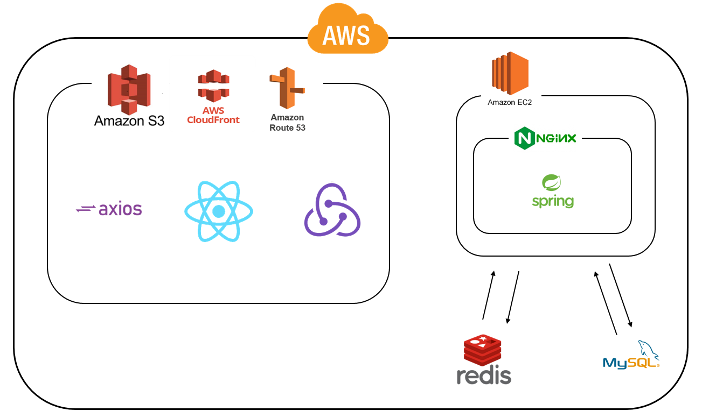

# 🐶개팅 Getting

저희 개팅은 반려견에 대한 교육을 통해 예비 견주님들께는 반려견을 키울 수 있다는 자신감을,

임보자님들께는 믿고 맡길 수 있는 예비 견주님들을 만나실 수 있는 기회를 제공해드립니다.

이를 바탕으로 올바른 반려견 입양 문화를 지향하고자 하는 유기견 입양 웹앱 서비스입니다.

<h2>🌐<a href='https://getting.co.kr' target='_blank'>개팅에서 개팅하세요!</a></h2>

---

## 📝 개요
+ 프로젝트 이름 : 개팅 (Getting)
+ 기획 의도 : 
+ 개발 기간 : 2021.10.24 ~ 2021.12.04
+ 팀원
    + Front-end(React) : 김기철, 김현수, 이지훈
    + Back-end(Spring) : 송지은, 이다담, 최선강
    + Designer(UI/UX) : 윤서연, 장성윤
+ <a href='https://www.notion.so/Getting-f2a8f1ac6dea41f79d60b318f7c0e41a' target='_blank' >Notion</a>
+ <a href=''>시연 영상</a>
+ <a href='https://github.com/hanhae99-final-project-13/Getting-FrontEnd' target='_blank'>Front-end 깃허브</a>
+ <a href='https://github.com/hanhae99-final-project-13/docking-final-project' target='_blank'>Back-end 깃허브</a>

---

## 🧩 프로젝트 구조(아키텍쳐)
 

---

## 🧰 사용 패키지

+ react-slick 
  - 캐러셀 구현 패키지
---

## ⚙ 주요 기능

로그인

+ JWT 토큰 방식을 이용하여 로그인이 가능합니다.
+ 카카오 소셜 로그인이 가능합니다.

회원가입

+ 아이디 및 닉네임의 중복확인을 자동으로 체크합니다.
+ 문자 인증을 통해 휴대폰 인증을 할 수 있습니다.

메인 페이지

+ 최신 등록된 유기견들을 조회할 수 있습니다. (최대 6건)
+ 서비스 소개 페이지를 조회할 수 있습니다.
+ 필수지식 페이지를 조회할 수 있습니다.

입양하기 페이지

+ 유기견들의 간략한 정보를 볼 수 있고 상세 정보를 조회할 수 있습니다.
+ 분양 글 등록 기능이 있습니다.
+ 관심 등록한 강아지를 최상단에서 조회할 수 있습니다.
+ 조건과 일치한 유기견 검색 기능 (기간, 장소, 지역)이 있습니다. 
+ 최신순, 등록순으로 유기견을 조회할 수 있습니다.
+ 무한 스크롤 기능을 통해 분양글을 더 불러올 수 있습니다.

상세 페이지

+ 유기견들의 자세한 정보를 조회할 수 있습니다.
+ 유기견의 관심 등록(북마크)이 가능합니다.
+ 개팅의 필수지식을 이수한 경우 유기견의 입양을 신청할 수 있습니다.
+ 글 작성자의 경우 게시글 수정, 삭제가 가능합니다.
+ 댓글을 통해 여러 유저와 소통할 수 있습니다.
+ 댓글 등록자의 경우 댓글의 수정, 삭제가 가능합니다.

입양신청 페이지

+ 입양 신청자의 상세한 정보와 입양 될 반려견이 거주할 곳의 이미지 등을 분양글 등록자에게 전달합니다.

입양지식 페이지

+ 필수지식, 심화지식 1, 2를 조회할 수 있습니다.
+ 조회 후 내용을 기반으로 한 퀴즈를 풀어 교육을 이수하고 뱃지를 얻을 수 있습니다.
+ 필수지식을 이수해야만 입양 신청이 가능하며, 입양 신청시 글 등록자가 교육 이수 뱃지를 확인할 수 있습니다.

마이페이지

+ 프로필 사진 등록, 수정이 가능합니다.
+ 관심 친구로 등록한 유기견의 조회가 가능합니다.
+ 입양 신청한 게시글의 조회 및 입양 승락, 반려 조회가 가능합니다.
+ 내가 등록한 글을 조회할 수 있고, 입양을 신청한 사람의 교육 이수 현황과 정보, 입양 신청서 조회가 가능합니다.

알람페이지

+ 유저가 댓글 작성 시 실시간 알림 확인이 가능합니다.
+ 댓글 알림의 경우 클릭 시 해당 게시글로 이동합니다.
+ 유저가 입양을 신청했을 경우 실시간 알림 확인이 가능합니다.
+ 입양 신청의 경우 클릭 시 해당 유저의 신청서를 조회할 수 있습니다.

---

## 🛠 개선사항

<a href='https://www.notion.so/9514c3bedbb8428aa72663125bdd0014' target='_blank'>사용자 피드백 </a>

---

## ✍ 개인회고

